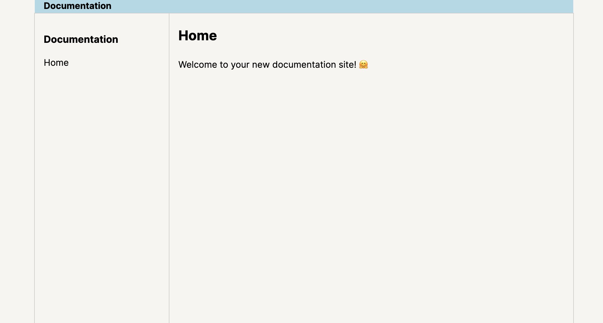

# Documentation Template

A documentation template built in Aurora, based on the [Aurora documentation](https://aurora.jamesg.blog.).



## How to Use

First, install Aurora:

```
pip install aurora-ssg
```

Then, run:

```
git clone https://github.com/capjamesg/aurora-docs-template
cd aurora-docs-template
```

To start developing the site, run:

```
aurora serve
```

When you are ready to generate a version of your site for publishing, update the `production` base URL in the `config.py` file, then run:

```
aurora build
```

This will generate a static version of your site in the `_site` directory, ready for use.

## License

This project is licensed under a Creative Commons Zero license.
